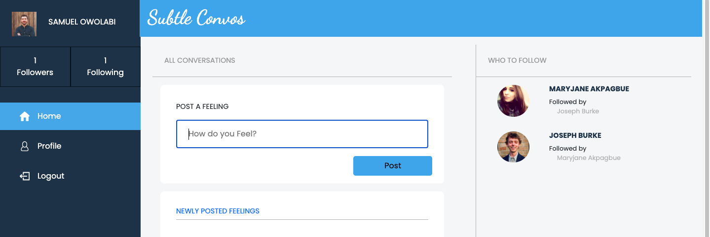
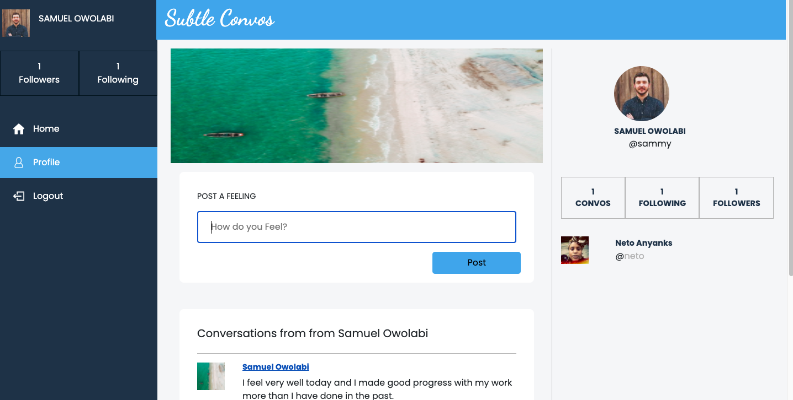

# Subtle Convos  

> This application was built as a platform for users to communicate with other users about the current state of their minds, communcating thoughts, feelings and ideas whilst getting feedback from other users.
It mimics twitter's functionalities where users can sign up and connect with other users.

The major functionalies of this application are as follows:

- User can create accounts and upload images upon the creation of accounts
- Users can log into their accounts with their usernames
- Users can create Posts(Feelings in this case)
- Users can comment on created posts
- Users can follow other Users
- Users can be followed by other users
- Users can view a single user and see their statistics and all Feelings created by them.
- Users can see which users to follow if they are not currently following those users.





## Built With

- Ruby v2.7.0
- Ruby on Rails v5.2.4
- Bootstrap 4
- SCSS
- Postgres: >=9.5
- MacOS
- VSCode


## Live Demo

[Live Demo Link ](https://warm-ravine-81710.herokuapp.com/users/sign_in)

### Prerequisites

- Ruby: 2.6.3
- Rails: 5.2.3
- Postgres: >=9.5


### Setup

1. Clone this repository by using the Terminal to navigate to the desired location on your computer and then enter the following line of code into the Terminal:
```
git clone git@github.com:Maryjanee/Subtle-convos.git
```
2. Run `cd Subtle` to move inside the downloaded repository.
3. Run `bundle install` and `Yarn install` seperately to download the project's dependencies.
4. Run `yarn check --integrity` to verify that the package dependencies have not been altered.
4. Run `rails db:setup` and `rails db:migrate` to set up your local database.
5. Run `rails console` to open a console in the environment. From here you will be able to make edits to the application from your local environment.


### Usage

Start server with:

```
    rails server
```

Open `http://localhost:3000/` in your browser.

### Run tests

```
    rpsec --format documentation
```


 Authors

👤 **Maryjane Akpagbue**

- Github: [Maryjanee](https://github.com/Maryjanee)
- Twitter: [Maryjane Akpagbue](https://twitter.com/alfredmaryjane)
- Linkedin: [Maryjane Akpagbue](https://www.linkedin.com/in/maryjane-akpagbue)


## Contributing

- To contribute to this project:
- Fork this repository & clone locally.
- Create an upstream remote and sync your local copy.
- create a new branch.
- Push your code to your origin repository.
- Create a new Pull Request .


## Show your support

Give a ⭐️ if you like this project!

## Acknowledgments

- Microverse